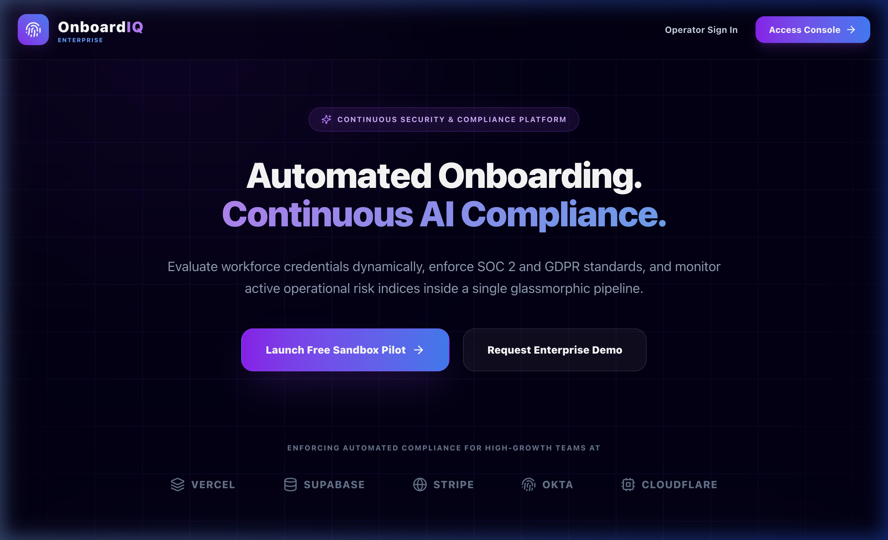
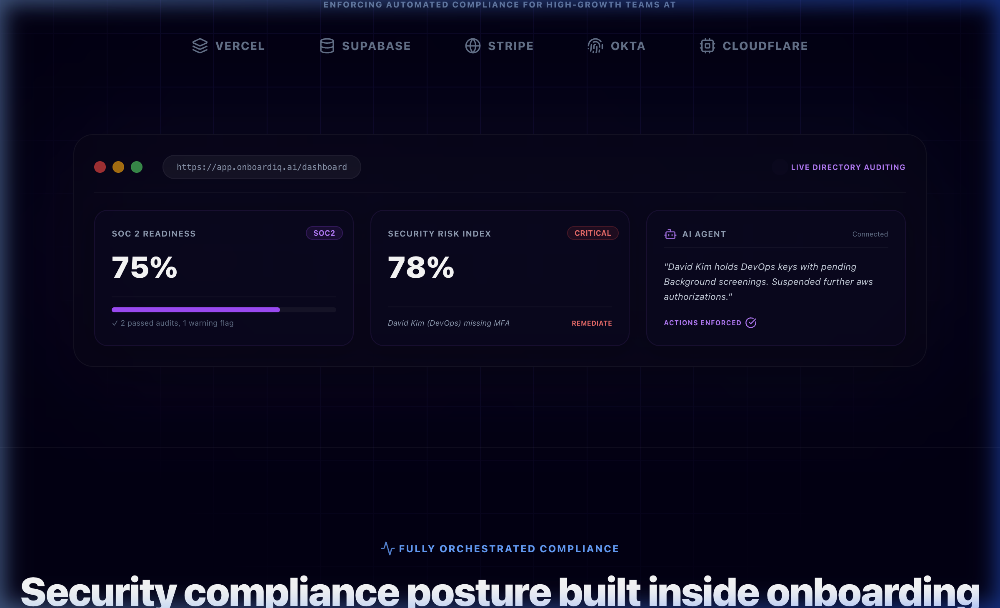

# OnboardIQ AI — Enterprise Compliance & Security Onboarding SaaS

....... **Live Application Link**: [https://onboardiq-ai-x3th.vercel.app](https://onboardiq-ai-x3th.vercel.app)

OnboardIQ AI is a state-of-the-art full-stack employee onboarding and continuous security compliance SaaS application. Fully equipped with modern analytics, AI-powered compliance assistance, secure drag-and-drop file upload logs, and the **ArmorIQ Enterprise Security SDK** gateway.

---

## << Live Production Screenshot ....>>>>>


Here is our live deployed application on Vercel:-----


*Figure 1: Premium landing page featuring deep glowing mesh backdrops, floating partner badges, and dual-glow call-to-actions.*


*Figure 2: Custom-styled browser mockup displaying live compliance indicators, security audits scanning logs, and the integrated AI Assistant Widget.*

---

## 💎 Key Achievements...............

### 1. Database Architecture & Models...
- Defined stable Prisma schema in `database/schema.prisma` covering:
  - `User`: Admin/HR accounts with secure role-based access.
  - `Employee`: Staff details with live risk and compliance score parameters.
  - `AuditLog`: High-fidelity transaction logger for administrative actions.
  - `SecurityAlert`: Tracks live compliance violations.
  - `ComplianceReport`: Tracks operational audits against *SOC 2*, *GDPR*, and *ISO 27001*.
  - `ChatMessage`: Chat history records for the AI Copilot.

### 2. ArmorIQ Enterprise Security SDK Integration
We built a robust, centralized security layer inside `backend/src/utils/armorIQ.ts` protecting the entire monorepo:
- **🔒 Policy Enforcement (`ArmorIQ.enforcePolicy`)**: Blocks unauthorized roles from executing privileged mutations (like directory deletions).
- **⚠️ Suspicious Activity Heuristics (`ArmorIQ.detectSuspiciousActivity`)**: Scans inbound request payloads to detect and neutralize SQL Injections or privilege escalations before routes execute.
- **⚙️ Secure Workflow Validation (`ArmorIQ.validateWorkflow`)**: Halts directory console access for high-privilege hires (like DevOps Specialists) if they bypass critical background checkpoints or hardware MFA setups.
- **✍️ Centralized Audit Logging (`ArmorIQ.logAudit`)**: Commits chronological administrative events directly to the database audit streams.

### 3. Modern Next.js + Framer Motion Frontend
- Set up a highly optimized portal in `frontend/`:
  - **Landing Page**: Delicate floating brand logos, glowing buttons, and grid mesh backdrops.
  - **Dashboard**: Interactive stats, live Recharts Area/Bar trends, and an **embedded AI Assistant Widget** answering real-time compliance prompts.
  - **Employees**: Personnel directories, secure drag-and-drop document upload pipelines, and onboarding overlays.
  - **AI Copilot**: Dedicated full-screen standalone chatbot console.

---

## 🛠️ How to Launch the Application Locally

Follow these steps to run both the frontend and backend servers on your local machine:

### Step 1: Run the Backend Server
```bash
# Navigate to the backend directory
cd backend

# Install dependencies (Prisma v6.2.1)
npm install

# Compile the Prisma client and start development
npx prisma generate --schema=../database/schema.prisma
npm run dev
```
*The API server will launch at [http://localhost:5050](http://localhost:5050).*

### Step 2: Run the Frontend Server
```bash
# Navigate to the frontend directory
cd frontend

# Install dependencies and start development
npm install
npm run dev
```
*The web portal will run at [http://localhost:3000](http://localhost:3000).*

---

## ⚡ Deployment & Hosting Configuration
We configured the project for seamless monorepo orchestration on Vercel using `vercel.json`:
*   **Next.js Frontend (`frontend`)**: Mounted on your root domain `/`.
*   **Node.js/Express Backend (`backend`)**: Routed under `/_/backend` to serve as a serverless backend layer with pre-build Prisma compilation:
    ```json
    "build": "prisma generate --schema=../database/schema.prisma && rimraf dist && tsc"
    ```

---

## 💡 Architectural Highlights

> **Adaptive Fallback System**: If `DATABASE_URL` is omitted, the backend adapter seamlessly routes all actions to a mock stateful memory database. This guarantees instant out-of-the-box local testing capabilities.

> **Least Privilege Access**: Personnel assigned to sensitive departments (e.g. Engineering/DevOps) are automatically tagged with higher initial risk ratings, requiring mandatory compliance checklists to be ticked off before cloud credentials can be provisioned.
